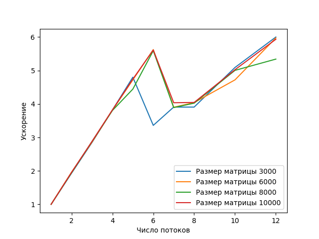

# Отчет
### Условие задачи
Написать программу вычисления матричного выражения: 

```A = Tr(B C E) C + I + <B E x, y>/<x, y>```

Распараллелить эту программу с помощью OpenMP (parallel, task).
Исследовать зависимость масштабируемости параллельной версии программы от ее вычислительной трудоемкости (размера матриц).
Проверить корректность параллельной версии.
Проверка закона Амдала. Построить зависимость ускорение:число потоков для заданного примера.

### Условия экспериментов
```
Architecture:           x86_64
CPU op-mode(s):         32-bit, 64-bit

CPU cores:                 12
CPU: Intel(R) Xeon(R) E-2136 CPU @ 3.30GHz
RAM:                    64GB

OpenMP 4.5
g++ (GCC) 10.2.0
```

### Описание решения
Вычисление выражения в программе разделено на следующие шаги:
1. Вычисление матрицы CE
2. Вычисление следа матрицы BCE
3. Вычисление скалярного произведения <B E x, y>
4. Вычисление скалярного произведения <x, y>
5. Вычисление итогового результата


Циклы во всех шагах были распараллелены с помощью конструкции parallel for; в шагах 2, 3, 4 используется опция reduce. Также шаги 2, 3, 4 вычисляются независимо друг от друга.


### Программный код
Доступен в репозитории GitHub
[https://github.com/iliya-b/HighPerfomanceComputing/blob/f8ddacbce2bd4d90e386ee09e369ba36c506d385/lab_parallel.cpp](https://github.com/iliya-b/HighPerfomanceComputing/blob/f8ddacbce2bd4d90e386ee09e369ba36c506d385/lab_parallel.cpp)

### Результаты измерений

На графике представлены результаты измерения ускорения вычислений в зависимости от числа потоков. Экспериментальный запуск проведен для случайно заполненных матриц размера 3000, 6000, 8000 и 10000.




В таблице приведены замеры времени вычислений и ускорения
|#Потоков|Время (мс)|Ускорение|
|-------|----|-------|
| 1     |1869| -    |
| 2     |956 |1.955|
| 3     |649 |2.879|
| 4     |489 |3.822|
| 5     |394 |4.743|
| 6     |333 |5.612|
| 7     |463 |4.036|
| 8     |462 |4.045|
| 10    |372 |5.024|
| 12    |315 |5.933|

### Выводы
Эксперименты показывают, что ускорение не превышает теоретически возможное ускорение в N раз, где N - число потоков. График масштабируемости показывает, что при использовании от 2 до 5 потоков программа получает ускорение, практически равное числу потоков. Если число потоков больше 5, то ускорение растет медленнее и даже может быть меньше, чем с меньшим числом потоков, что можно объяснить неидеальным распараллеливанием и накладными расходами на использование потоков.
