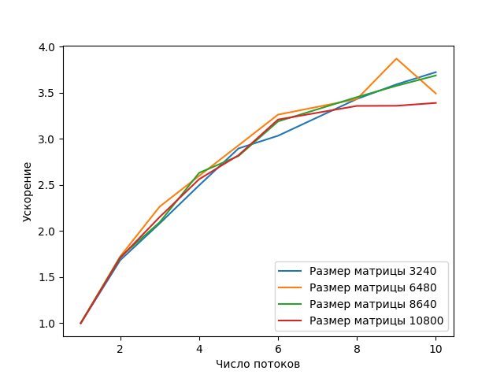

# Отчет
### Условие задачи
Написать программу вычисления матричного выражения: 

```A = Tr(B C E) C + I + <B E x, y>/<x, y>```

Распараллелить эту программу с помощью MPI.
Исследовать зависимость масштабируемости параллельной версии программы от ее вычислительной трудоемкости (размера матриц).
Проверить корректность параллельной версии.
Проверка закона Амдала. Построить зависимость ускорение:число потоков для заданного примера.

### Условия экспериментов
```
Architecture:           x86_64
CPU op-mode(s):         32-bit, 64-bit

CPU cores:                 12
CPU: AMD EPYC-Milan Processor
RAM:                   32GB

HYDRA build details: Version: 4.0
g++ 11.4.0
```

### Описание решения
Вычисление выражения в программе разделено на следующие шаги:
1. Вычисление матрицы CE
2. Вычисление следа матрицы BCE
3. Вычисление скалярного произведения <B E x, y>
4. Вычисление скалярного произведения <x, y>
5. Вычисление итогового результата


Циклы во всех шагах были распараллелены путем распределения работы по всем процессорам, а результаты работы объединяются с помошью функции MPI_Allgather; в шагах 2, 3, 4 используется функция MPI_Allreduce. 

### Проверка корректности
Для проверки корректности вычислений результаты работы программы сравнивались с эталонными результатами python-скрипта. Входные данные и результаты доступны во вложении.
```
import numpy as np

n = 50
with open('B.txt', 'r') as f:
    B = eval(f.read())
with open('C.txt', 'r') as f:
    C = eval(f.read())
with open('x.txt', 'r') as f:
    x = eval(f.read())
with open('y.txt', 'r') as f:
    y = eval(f.read())
B = np.array(B)
C = np.array(C)
x = np.array(x)
y = np.array(y)
E = np.ones((n,n))
I = np.identity(n)
tr = np.trace(B@C@E)
A = C * tr + I + np.dot(B@E@x, y) / np.dot(x, y)
np.set_printoptions(precision=10)
print(A)
```


### Программный код
Доступен в репозитории GitHub и в приложении
[https://github.com/iliya-b/HighPerfomanceComputing/blob/main/mpi/lab_mpi.cpp](https://github.com/iliya-b/HighPerfomanceComputing/blob/main/mpi/lab_mpi.cpp)

### Результаты измерений

На графике представлены результаты измерения ускорения вычислений в зависимости от числа потоков. Проведено три экспериментальных запуска для случайно заполненных матриц размера 3240, 6480, 8640 и 10800. Результаты измерений усреднены.




В таблице приведены замеры времени вычислений и ускорения
|#Потоков|Время (мс)|Ускорение|
|-------|----|-------|
|1|2573.67|1.00|
|2|1506.33|1.71|
|3|1195.67|2.15|
|4|1004.33|2.56|
|5|911.33|2.82|
|6|801.67|3.210|
|8|766.33|3.36|
|9|766|3.36|
|10|759|3.39|


### Выводы
Эксперименты показывают, что ускорение не превышает теоретически возможное ускорение в N раз, где N - число потоков. График масштабируемости показывает, что увеличение числа процессоров дает прирост ускорения. Рост ускорения при увеличении числа процессоров от 6 до 10 заметно меньше, чем от 2 до 6. Замедление ускорения может быть связано с увеличением накладных расходов на пересылку сообщений (промежуточных результатов вычислений).