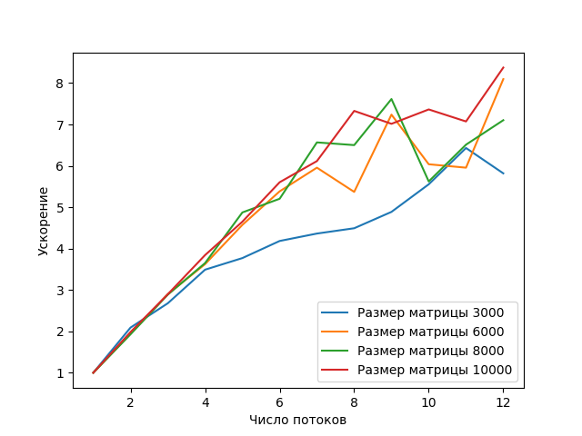
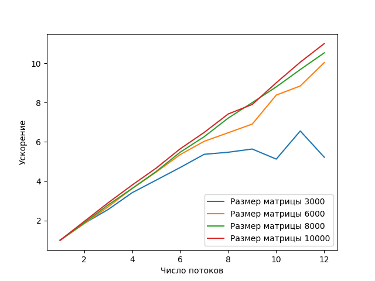

# Отчет
### Условие задачи
Написать программу вычисления матричного выражения: 

```A = Tr(B C E) C + I + <B E x, y>/<x, y>```

Распараллелить эту программу с помощью OpenMP (parallel, task).
Исследовать зависимость масштабируемости параллельной версии программы от ее вычислительной трудоемкости (размера матриц).
Проверить корректность параллельной версии.
Проверка закона Амдала. Построить зависимость ускорение:число потоков для заданного примера.

### Условия экспериментов
```
Architecture:           x86_64
CPU op-mode(s):         32-bit, 64-bit

CPU cores:                 12
CPU: AMD EPYC-Milan Processor
RAM:                   32GB

OpenMP 4.5
g++ (GCC) 10.2.0
```

### Описание решения
Вычисление выражения в программе разделено на следующие шаги:
1. Вычисление матрицы CE
2. Вычисление следа матрицы BCE
3. Вычисление скалярного произведения <B E x, y>
4. Вычисление скалярного произведения <x, y>
5. Вычисление итогового результата

#### Реализация с помощью parallel

Циклы во всех шагах были распараллелены с помощью конструкции parallel for; в шагах 2, 3, 4 используется опция reduce. Также шаги 2, 3, 4 вычисляются независимо друг от друга.

#### Реализация с помощью task
Циклы во всех шагах были распараллелены с помощью конструкции task; в шагах 2, 3, 4 используется конструкция critical для корректного сложения промежуточных результатов. Как и в случае parallel, шаги 2, 3, 4 вычисляются независимо друг от друга.

### Проверка корректности
Для проверки корректности вычислений результаты работы программы сравнивались с эталонными результатами python-скрипта.
```
import numpy as np

n = 3
with open('B.txt', 'r') as f:
    B = eval(f.read())
with open('C.txt', 'r') as f:
    C = eval(f.read())
with open('x.txt', 'r') as f:
    x = eval(f.read())
with open('y.txt', 'r') as f:
    y = eval(f.read())
B = np.array(B)
C = np.array(C)
x = np.array(x)
y = np.array(y)
E = np.ones((n,n))
I = np.identity(n)
tr = np.trace(B@C@E)
A = C * tr + I + np.dot(B@E@x, y) / np.dot(x, y)
np.set_printoptions(precision=10)
print(A)
```


### Тестовый пример.

```
B = [[52.3023047,   669.2010553,    751.6734906, ],
    [430.9177349,   477.543168,     -844.6690238, ],
    [-723.4231163,  -762.3984539,   -938.4145106, ]]

C = [[-465.2621,    494.1816993, 443.4919579, ],
    [-784.5697798,  231.3516984, 609.524756, ],
    [-902.4156828,  -620.283891, -374.1261907, ]]

x = [-948.7161128, -77.2906338, 860.4022906, ]
y = [-973.1533202, -418.5129365, 77.65702866, ]
```

Результат

```
[[-8.6751426160e+08  9.2143746214e+08  8.2692280650e+08]
 [-1.4628863156e+09  4.3137209010e+08  1.1365028577e+09]
 [-1.6826184474e+09 -1.1565635019e+09 -6.9758482722e+08]]
 ```

### Программный код
Доступен в репозитории GitHub
[https://github.com/iliya-b/HighPerfomanceComputing/blob/main/lab_parallel.cpp](https://github.com/iliya-b/HighPerfomanceComputing/blob/main/lab_parallel.cpp)

### Результаты измерений

На графике представлены результаты измерения ускорения вычислений в зависимости от числа потоков. Проведено три экспериментальных запуска  для случайно заполненных матриц размера 3000, 6000, 8000 и 10000. Результаты измерений усреднены.


#### Parallel


В таблице приведены замеры времени вычислений и ускорения для матрицы размером 10000.
|#Потоков|Время (мс)|Ускорение|
|-------|----|-------|
| 1     |2032.33| -    |
| 2     |1024 |1.98|
| 3     |701.33 |2.89|
| 4     |528.67  |3.844|
| 5     |437.0 |4.65|
| 6     |362.67 |5.6|
| 7     |332.33 |6.12|
| 8     |277.33 |7.32|
| 10    |276.67 |7.36|
| 12    |242.67 |8.38|

#### Task


В таблице приведены замеры времени вычислений и ускорения для матрицы размером 10000.
|#Потоков|Время (мс)|Ускорение|
|-------|----|-------|
|1|2105.33|-|
|2|1079.0|1.95 |
|3|724.67|2.90 |
|4|553.0|3.80 |
|5|451.0|4.66 |
|6|372.67|5.64|
|7|324.67|6.48 |
|8|283.67|7.42 |
|9|266.33|7.90|
|10|233.67|9.00|
|11|209.33|10.05|
|12|191.33|11.00|

### Выводы
Эксперименты показывают, что ускорение не превышает теоретически возможное ускорение в N раз, где N - число потоков.

График масштабируемости показывает, что при использовании конструкции task, ускорение близко к линейному, за исключением матрицы самого малого размера. Последнее объясняется тем, что доля времени параллельных вычислений становится малой по сравнению с временем накладных задач и последовательных вычислений.

В случае использования parallel, ускорение близко к линейному при использовании 2-5 потоков, однако снижается при большем количестве.


